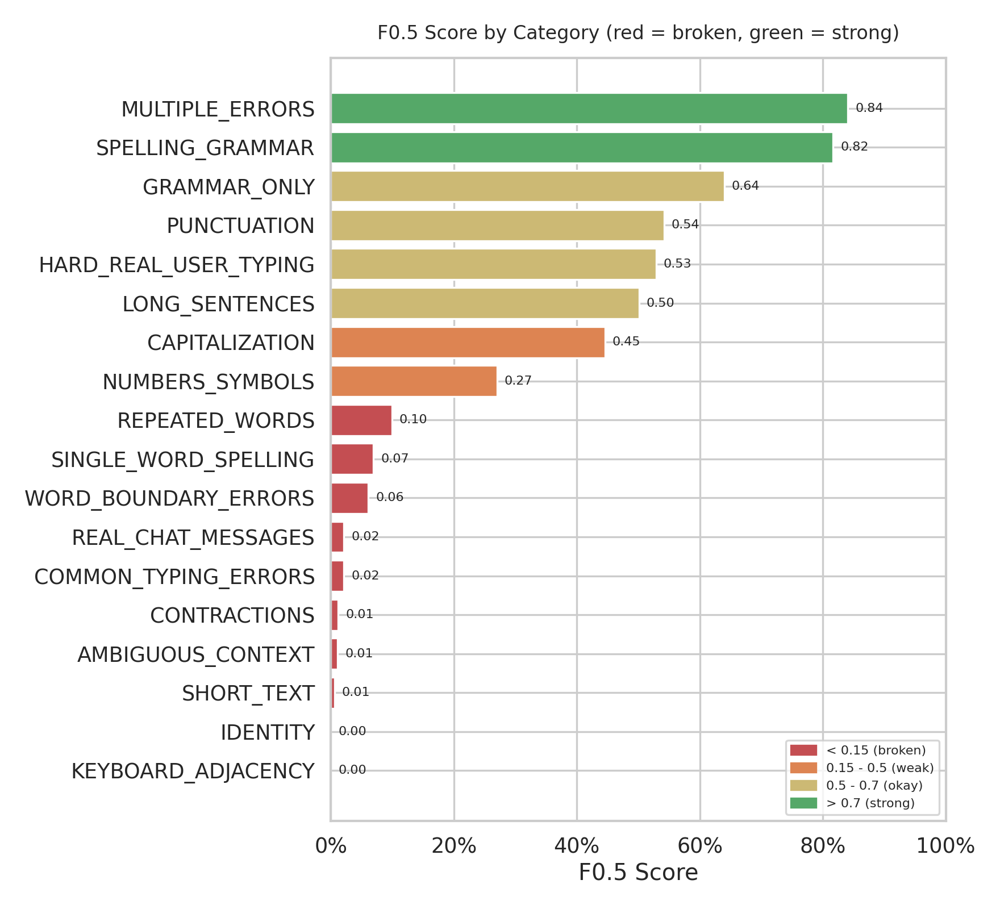
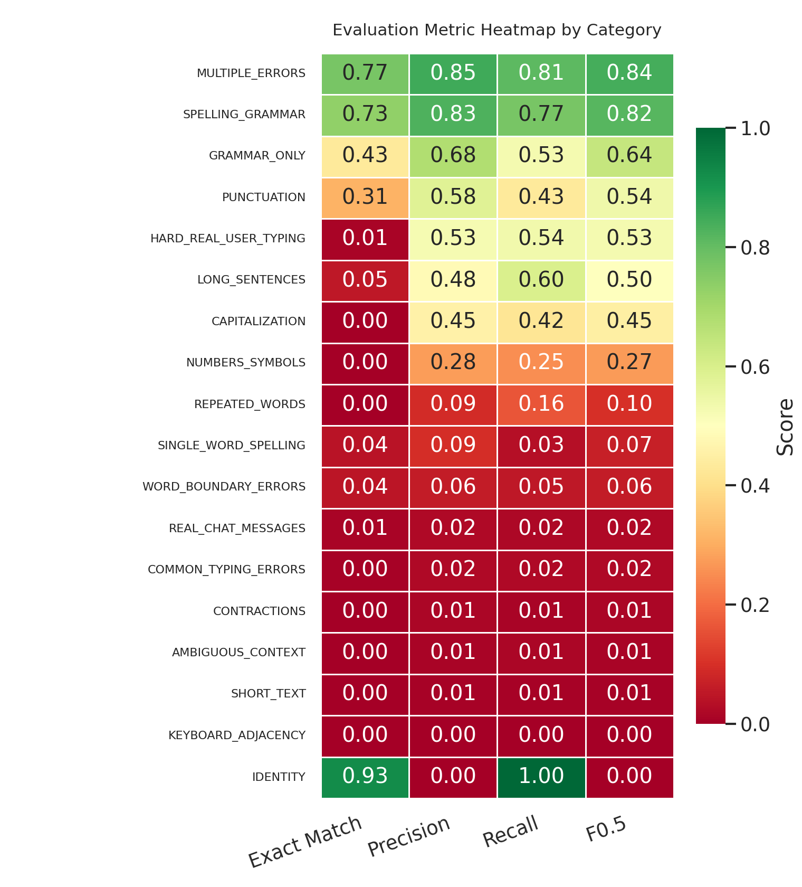
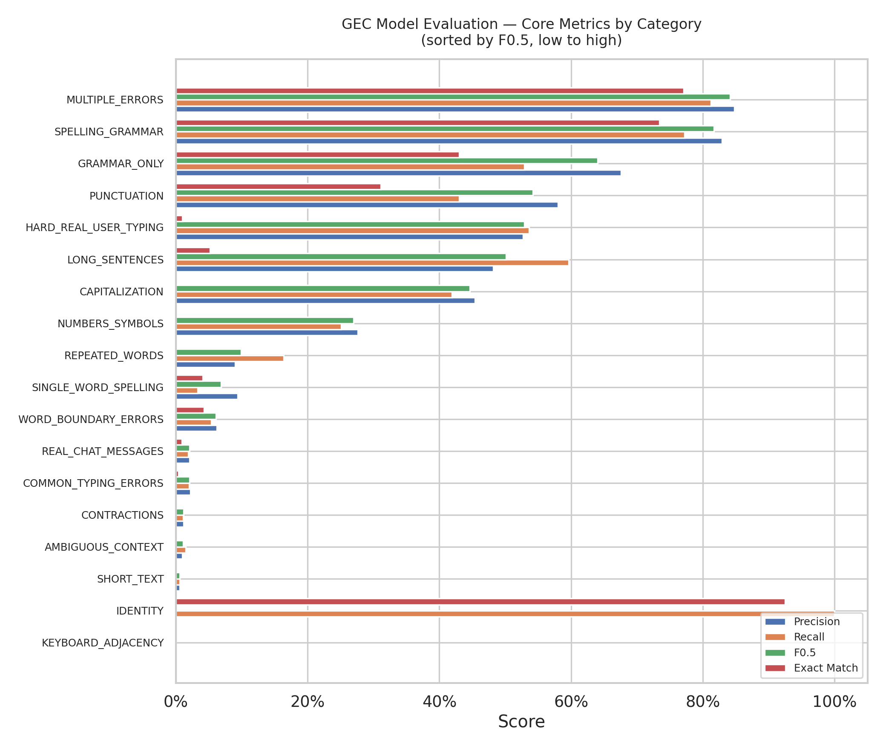
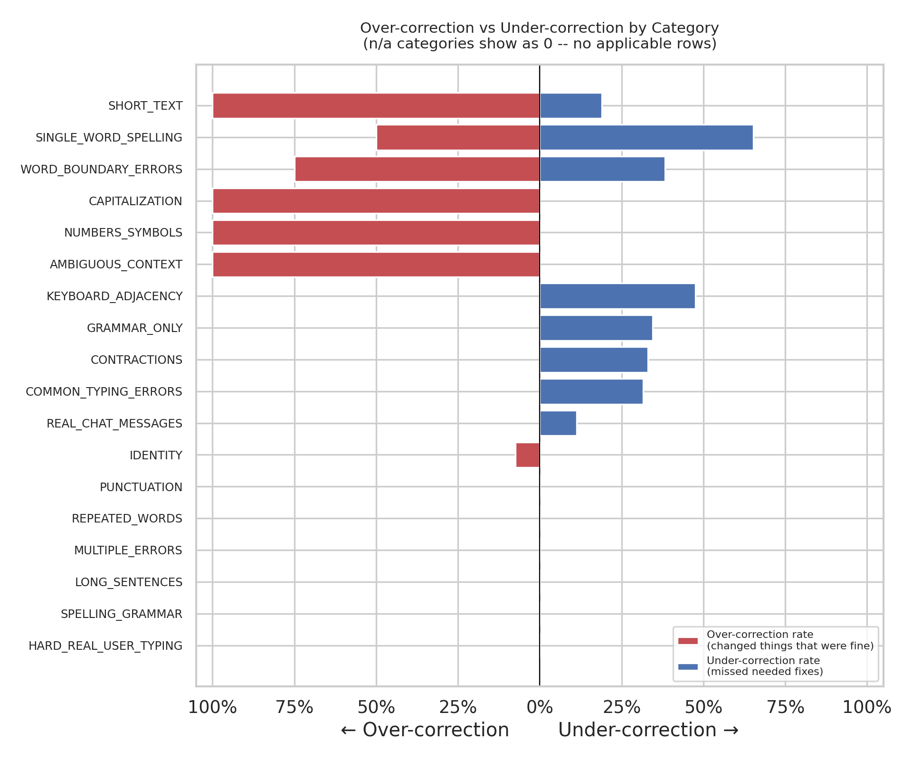

# ✍️ Neural Grammar & Synthetic Noise Corrector

[](https://pytorch.org/)
[](https://streamlit.io/)
[](https://github.com/huggingface/tokenizers)
[](#-evaluation--benchmark-results)
[](LICENSE)

An end-to-end Sequence-to-Sequence (Seq2Seq) Transformer model designed to correct real-world grammar, typographical mistakes, spacing anomalies, and colloquial chat slang. Built from scratch in PyTorch and trained on multi-million sentence pairs using progressive curriculum noise scheduling.

---

## 🌟 Key Highlights

- **Custom Transformer Architecture**: 6-layer Encoder-Decoder ($d_{model} = 256$, 8 heads) featuring **Sinusoidal Positional Encoding** for dynamic length generalization.
- **Custom Byte-Level BPE Tokenizer**: 32,000 subword vocabulary designed to handle arbitrary out-of-vocabulary typing errors without fallback `<unk>` degradation.
- **3-Stage Curriculum Switching**: Switch dynamically between **Stage 1 (Light)**, **Stage 2 (Medium)**, and **Stage 3 (Heavy/Final)** checkpoints, or compare all 3 side-by-side in real time.
- **Curriculum Training Strategy**: Staged training across progressive noise regimes (**Light** $\rightarrow$ **Medium** $\rightarrow$ **Heavy**) with a balanced **25% Identity ratio** to actively prevent over-correction on already-correct text.
- **Autoregressive Degeneration Safeguards**: Integrated dynamic 3-gram repetition blocking and repetition scoring fallbacks to prevent infinite loops during decoding.
- **Live Interactive Showcase**: Built-in Streamlit web app featuring real-time visual diff breakdown, preset error cases, and benchmark dashboards for technical interviews.

---

## 🚀 Live Demo & Web App

Launch the interactive web application locally:

```bash
# 1. Install dependencies
pip install -r requirements.txt

# 2. Launch the Streamlit showcase
streamlit run app.py
```

### Deploying to Hugging Face Spaces (Free 24/7 Hosting)
1. Create a new Space on [Hugging Face](https://huggingface.co/spaces) and select **Streamlit** as the SDK.
2. Push this repository's contents to the Space repository.
3. Access your live web link anytime during technical interviews!

---

## 📊 Evaluation & Benchmark Results

The model was comprehensively evaluated on **3,083 test sentences across 18 error categories** using word-level diff opcodes (ERRANT-style proxy):

| Metric | Score | Description |
| :--- | :--- | :--- |
| **Overall $F_{0.5}$** | **0.456** | Prioritizes precision over recall to discourage erroneous edits |
| **Overall Precision** | **0.458** | Accuracy of made corrections |
| **Overall Recall** | **0.451** | Coverage of detected errors |
| **Identity Exact Match** | **92.5%** | Successfully leaves valid sentences untouched (low false positive rate) |
| **Multiple Errors $F_{0.5}$** | **0.841** | High accuracy on compound grammar and spelling issues |
| **Spelling & Grammar $F_{0.5}$** | **0.817** | Robust performance on standard written English errors |

<p align="center">
  
  
</p>

<p align="center">
  
  
</p>

---

## 🛠️ Repository Structure

```text
gec-transformer/
├── app.py                      # Interactive Streamlit Web Application (Live Showcase)
├── inference.py                # Core model definition & CLI inference script
├── train.py                    # Modular PyTorch training pipeline with mixed precision
├── train_token.py              # Byte-Level BPE tokenizer training script
├── evaluate.py                 # Word-level edit PRF benchmark evaluation script
├── visual.py                   # Plotting script for evaluation charts
├── tokenizer/                  # Pretrained vocabulary & merge tables
│   ├── vocab.json
│   └── merges.txt
├── data/                       # Benchmark test sets & summary metrics
│   ├── gec_benchmark.csv
│   └── eval_summary.csv
├── assets/                     # Benchmark charts and convergence curves
│   ├── gec_eval_f05_ranked.png
│   ├── gec_eval_main_metrics.png
│   ├── gec_eval_heatmap.png
│   ├── gec_eval_over_under_correction.png
│   └── loss_curve_final.png
├── requirements.txt            # Python dependencies
├── .gitignore                  # Checkpoint & data protection
└── README.md                   # Documentation & showcase
```

---

## 💻 CLI Usage

### 1. Interactive Inference
```bash
python inference.py --checkpoint checkpoints/epoch_20.pt
```

### 2. Run Benchmark Evaluation
```bash
python evaluate.py --csv data/gec_benchmark.csv --summary data/eval_summary.csv
```

### 3. Generate Evaluation Charts
```bash
python visual.py --csv data/eval_summary.csv --out_dir assets
```

### 4. Train Model from Scratch
```bash
python train.py --data_csv path/to/dataset.csv --epochs 3 --batch_size 32 --lr 1e-4
```

---

## 🧠 Model Architecture & Technical Details

### Sinusoidal Positional Encoding
Rather than rigid learned embeddings capped at fixed sequence lengths, the model uses canonical sinusoidal position functions:

$$PE_{(pos, 2i)} = \sin\left(\frac{pos}{10000^{2i/d_{model}}}\right)$$
$$PE_{(pos, 2i+1)} = \cos\left(\frac{pos}{10000^{2i/d_{model}}}\right)$$

### Loss Function & EOS Weighting
To combat the common sequence-to-sequence pathology where decoders fail to terminate, the loss function specifically penalizes missed `<eos>` tokens with a $5\times$ weighting factor:
```python
weights = torch.ones(vocab_size)
weights[eos_idx] = 5.0
criterion = nn.CrossEntropyLoss(ignore_index=pad_idx, weight=weights)
```

---

## 📄 License
This project is licensed under the MIT License.
